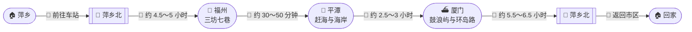
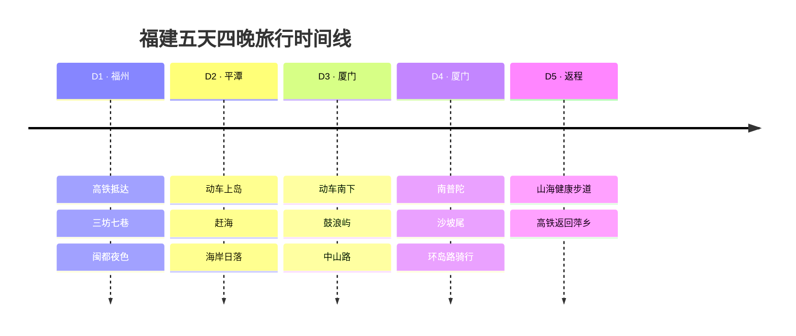
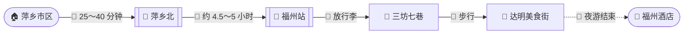
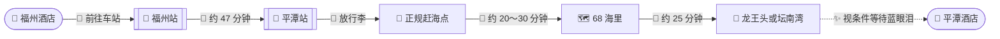
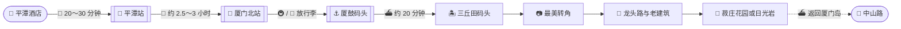
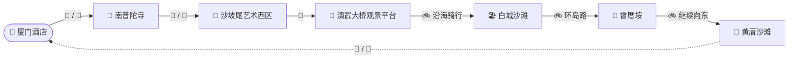
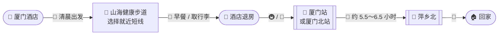

从江西萍乡出发，用五天时间串联 **福州、平潭和厦门**：在三坊七巷感受闽都人文，到平潭赶海看风车海岸，再去鼓浪屿与厦门环岛路慢慢散步。

本次行程时间为 **2026 年 9 月 19 日至 9 月 23 日**，共五天四晚。

> [!NOTE] 行程速览
> **D1 福州人文 → D2 平潭看海 → D3 鼓浪屿 → D4 厦门经典路线 → D5 山海步道与返程**。全程以高铁、动车和市内公共交通为主，不需要自驾跨城。

> [!IMPORTANT] 这是一份出发前计划
> 火车班次、鼓浪屿航班、潮汐和滨海景区开放状态都可能调整。文中的班次与车程用于制定计划，最终以 `12306`、厦门轮渡和平潭官方通知为准。

## 📌 行程导航

- [🗓️ 五天行程总览](#五天行程总览)
- [🧭 跨城交通路线图](#跨城交通路线图)
- [🎫 车票与住宿安排](#车票与住宿安排)
- [🚄 Day 1：福州](#day-1闽都初见)
- [🌊 Day 2：平潭](#day-2平潭赶海)
- [⛴️ Day 3：鼓浪屿](#day-3鼓浪屿漫游)
- [🚲 Day 4：厦门环岛](#day-4厦门经典路线)
- [🥾 Day 5：山海步道](#day-5山海步道与返程)
- [💰 预算与检查清单](#预算参考)

---

## 🗓️ 五天行程总览

| 📅 日期 | ✨ 今日主题 | 🧭 核心路线 | 🏨 住宿 |
| :--- | :--- | :--- | :---: |
| **D1 · 9 月 19 日**<br/>周六 | **🚄 闽都初见**<br/>高铁抵达福州 | 萍乡北 → 福州<br/>→ 三坊七巷 → 达明美食街 | **福州**<br/>第 1 晚 |
| **D2 · 9 月 20 日**<br/>周日 | **🌊 平潭赶海**<br/>海岛与日落 | 福州 → 平潭<br/>→ 赶海 → 68 海里 → 龙王头 | **平潭**<br/>第 2 晚 |
| **D3 · 9 月 21 日**<br/>周一 | **⛴️ 鼓浪屿漫游**<br/>动车转轮渡 | 平潭 → 厦门北<br/>→ 厦鼓码头 → 鼓浪屿 | **厦门**<br/>第 3 晚 |
| **D4 · 9 月 22 日**<br/>周二 | **🚲 鹭岛慢生活**<br/>骑行与城市漫步 | 南普陀 → 沙坡尾<br/>→ 白城沙滩 → 环岛路 | **厦门**<br/>第 4 晚 |
| **D5 · 9 月 23 日**<br/>周三 | **🥾 山海晨行**<br/>清晨步道后返程 | 山海健康步道<br/>→ 厦门/厦门北 → 萍乡北 | **返程** |

> [!TIP] 行程节奏
> 四晚分别安排为 **福州 1 晚、平潭 1 晚、厦门 2 晚**。D2 与 D3 都需要早起换乘，建议轻装出行，并选择交通方便的住宿区域。

## 🧭 跨城交通路线图





> [!TIP] 路线图说明
> 路线图用于展示城市之间的先后关系，不代替实时导航。铁路运行图可能调整，购票时优先选择直达车；没有直达车时再使用 `12306` 推荐的同站换乘方案。

---

## 🎫 车票与住宿安排

### 🚄 四段车票

| 日期 | 🚏 交通路段 | ⏱️ 参考时间 | 💡 购票策略 |
| :---: | :--- | :--- | :--- |
| **9 月 19 日** | 萍乡北 → 福州 | 约 4.5～5 小时 | 选择上午出发的直达高铁 |
| **9 月 20 日** | 福州/福州南 → 平潭 | 约 30～50 分钟 | 尽量购买最早一批动车 |
| **9 月 21 日** | 平潭 → 厦门北/厦门 | 约 2.5～3 小时 | 优先上午直达动车 |
| **9 月 23 日** | 厦门/厦门北 → 萍乡北 | 约 5.5～6.5 小时 | 直达车多在上午，先买返程票 |

目前常见班次可以作为搜索线索：

- **福州 → 平潭**：`D6275` 约 06：57 出发、07：44 抵达。
- **平潭 → 厦门北**：`D6566` 约 07：38 出发、10：21 抵达。
- **平潭 → 厦门**：也可关注 `D3346`、`D6294` 等上午班次。
- **厦门 → 萍乡北**：可关注厦门站约 09：01 出发或厦门北约 10：09 出发的直达方案。

> [!WARNING] 班次仅供检索
> 上述车次来自近期运行信息，不代表 9 月 19 日至 23 日一定开行。请在 `12306` 输入实际日期重新确认，不根据本文单独购票。

### 🏨 三地住宿

| 城市 | 入住日期 | 推荐区域 | 选择理由 |
| :--- | :---: | :--- | :--- |
| **🏮 福州** | 9 月 19 日 | 三坊七巷附近或福州站附近 | 前者方便夜游，后者方便第二天早班动车 |
| **🌊 平潭** | 9 月 20 日 | 龙王头至县城中心 | 吃饭方便，前往平潭站约 20～30 分钟 |
| **🌴 厦门** | 9 月 21～22 日 | 中山路、厦门站或思明区 | 鼓浪屿、南普陀、沙坡尾与返程交通较方便 |

> [!NOTE] 如何选择福州酒店
> 如果 D2 确定乘坐 07：00 左右的早班动车，住福州站附近最省心；想充分体验三坊七巷夜景，则住三坊七巷附近，但第二天需要更早起床打车前往车站。

---

## Day 1｜🏮 闽都初见

**📅 9 月 19 日，周六　·　📍 萍乡 → 福州**



### ⏰ 推荐安排

| 时间 | 📍 地点 | ✨ 行程安排 |
| :---: | :--- | :--- |
| **07：30 左右** | 萍乡市区 | 前往萍乡北站 |
| **08：30～09：00** | 萍乡北 | 乘高铁前往福州 |
| **13：00～14：00** | 福州 | 抵达后前往酒店寄存行李 |
| **15：00～18：00** | 三坊七巷 | 南后街、衣锦坊、水榭戏台、林则徐纪念馆周边 |
| **18：00～20：00** | 达明美食街附近 | 晚餐，品尝福州小吃 |
| **20：00 以后** | 福州市区 | 散步后回酒店休息 |

三坊七巷适合用步行方式游览。第一天不再增加远距离景点，为第二天早起去平潭保留体力。

> [!TIP] 福州小吃
> 可以选择鱼丸、肉燕、锅边糊、芋泥和花生汤。美食街适合一次尝多种小吃，正式闽菜则建议另外找口碑稳定的餐厅。

---

## Day 2｜🌊 平潭赶海

**📅 9 月 20 日，周日　·　📍 福州 → 平潭**



### 🌊 潮汐与赶海

9 月 20 日的天文潮汐参考显示，上午约 **11：03 前后处于低潮附近**，推荐赶海时段大致为 **07：03～11：03**。当天属于微潮，潮差不算突出，适合把赶海当作体验项目，不预期获得大量海货。

> [!WARNING] 潮汐不等于安全保证
> 天文潮位没有包含台风、强风、降雨和风暴增水的影响。只去正规开放的赶海区域，最好参加有本地人员带领的体验；不进入陌生礁石区，不单独下海，不为了捡海货越走越远。

### ⏰ 推荐安排

| 时间 | 📍 地点 | ✨ 行程安排 |
| :---: | :--- | :--- |
| **06：20** | 福州酒店 | 退房，前往福州站 |
| **06：57～07：44** | 福州 → 平潭 | 参考早班动车，具体以 `12306` 为准 |
| **08：10～08：40** | 平潭 | 前往酒店寄存行李、简单早餐 |
| **09：00～11：00** | 正规赶海点 | 在安全区域体验赶海 |
| **11：30～12：30** | 县城/澳前附近 | 午餐、休息 |
| **13：00～16：00** | 68 海里 | 游览猴研岛及海岸景观 |
| **16：30～18：30** | 龙王头或坛南湾 | 看海、等待日落 |
| **19：00 以后** | 平潭县城 | 晚餐；根据实况决定是否等待蓝眼泪 |

### ✨ 关于蓝眼泪

9 月仍有机会遇到蓝眼泪，但概率通常低于春夏活跃期，不能作为必看项目。当天晚上先查看“畅游平潭”或当地官方发布的实时信息，再决定是否前往龙王头、坛南湾等开放海岸。

> [!NOTE] D2 的取舍
> 平潭只安排一天，不建议同时跑完整北线与南线。此方案优先满足“赶海、68 海里和日落”；如果不想赶海，可以改成 **仙人井 → 北港村 → 环岛路 → 长江澳** 的北线景观路线。

---

## Day 3｜⛴️ 鼓浪屿漫游

**📅 9 月 21 日，周一　·　📍 平潭 → 厦门**



### 🚆 平潭到厦门

为了给鼓浪屿留出足够时间，优先选择上午较早的直达动车。近期可供搜索的方案包括：

- `D6566`：平潭约 07：38 → 厦门北约 10：21。
- `D3346`：平潭约 08：54 → 厦门北约 11：19。
- `D6294`：平潭约 10：45 → 厦门北或厦门，抵达时间较晚，不是首选。

到达厦门后先把行李送到酒店，再前往 **厦门邮轮中心厦鼓码头（东渡客运码头）**。

### 🎫 鼓浪屿船票

外地游客白天通常从厦鼓码头前往鼓浪屿，建议购买前往 **三丘田码头** 的普通客船票，距离最美转角、龙头路等区域更近。

| 项目 | 建议 |
| :--- | :--- |
| **购票渠道** | 厦门轮渡官网或“屿见厦门”官方小程序 |
| **预售时间** | 通常提前 10 天线上预售 |
| **普通船票** | 约 ¥35/人，通常包含一次返程 |
| **推荐去程** | 根据动车到达时间，选择 14：00～15：30 左右航班 |
| **候船时间** | 官方建议提前约 1 小时到达码头 |
| **必带证件** | 购票时使用的身份证件原件 |

> [!IMPORTANT] 先买船票，再安排鼓浪屿当天时间
> 鼓浪屿船票采用实名和航班制。购买哪个码头、哪个时间的票，就前往对应码头候船；不要相信“内部票”“快速上岛”等非官方揽客信息。

### 🚶 岛上路线

```text
三丘田码头
  ↓
最美转角
  ↓
鼓浪屿老别墅与街巷
  ↓
龙头路
  ↓
菽庄花园 / 港仔后沙滩
  ↓
体力充足再去日光岩
```

9 月夜间返程航线可能调整。通常在傍晚后从三丘田码头返回厦门轮渡码头，靠近中山路；以当天码头广播和官方小程序为准。

---

## Day 4｜🚲 厦门经典路线

**📅 9 月 22 日，周二　·　📍 南普陀 → 沙坡尾 → 环岛路**



### ⏰ 推荐安排

| 时间 | 📍 地点 | ✨ 行程安排 |
| :---: | :--- | :--- |
| **08：00～10：00** | 🙏 南普陀寺 | 早晨游览，避开午后炎热 |
| **10：30～12：30** | 🎨 沙坡尾 | 艺术西区、避风坞，顺便午餐 |
| **13：00～14：00** | 🌉 演武大桥附近 | 看海、拍照，短暂休息 |
| **14：30～18：00** | 🚲 环岛路 | 白城沙滩 → 曾厝垵 → 黄厝沙滩 |
| **18：00～19：00** | 🌅 黄厝/环岛路 | 根据天气看日落 |
| **19：30 以后** | 🌃 厦门市区 | 晚餐并返回酒店 |

> [!TIP] 骑行方式
> 不需要从南普陀一路骑完全程。先使用公交或网约车完成南普陀、沙坡尾，再到白城沙滩附近租车骑环岛路，体力分配更合理。

### 🚲 骑行注意事项

- 优先使用正规共享单车或门店车辆。
- 骑车前检查车闸、轮胎、车锁和座椅。
- 不骑入机动车快速路、隧道和明确禁止非机动车的路段。
- 海风较大时缩短路线，黄厝不必强行骑到。
- 日落后尽量乘公交或网约车返回，不摸黑长距离骑行。

---

## Day 5｜🥾 山海步道与返程

**📅 9 月 23 日，周三　·　📍 厦门 → 萍乡**

厦门返回萍乡的直达高铁通常集中在上午，因此山海健康步道需要安排成 **清晨短线**，不能把完整上午都留给步道。



### ⏰ 推荐节奏

| 时间 | 📍 地点 | ✨ 行程安排 |
| :---: | :--- | :--- |
| **06：00～07：20** | 🥾 山海健康步道 | 选择距离酒店和车站较近的一段 |
| **07：30～08：00** | 酒店附近 | 早餐、取行李并退房 |
| **08：00 以后** | 🚉 火车站 | 按车次提前前往厦门站或厦门北站 |
| **上午** | 🚄 厦门 → 萍乡北 | 乘坐直达高铁返程 |
| **下午** | 🏠 萍乡 | 抵达萍乡北站并返回市区 |

近期时刻表中，厦门至萍乡北的直达车多在 **06：48～10：09** 之间发车，运行约 5 小时 36 分至 6 小时 25 分。购买返程票后，再根据实际发车站和时间决定步道入口。

> [!WARNING] 厦门站和厦门北站距离较远
> 厦门站位于厦门岛内，厦门北站位于集美区。前往厦门北站通常需要预留更长时间；不要看错车站，也不要为了多走一段步道压缩候车时间。

---

## 💰 预算参考

以下按照两人、中等消费估算：

| 🧾 消费项目 | 💴 两人预计费用 |
| :--- | ---: |
| 🚄 四段高铁/动车 | **¥1,900～2,500** |
| 🏨 福州 1 晚、平潭 1 晚、厦门 2 晚 | **¥1,200～2,200** |
| ⛴️ 鼓浪屿船票及景点 | **¥300～700** |
| 🚕 市内交通、租车或赶海体验 | **¥500～1,000** |
| 🍜 五天餐饮 | **¥1,000～1,600** |
| 🎫 其他门票与备用金 | **¥400～800** |
| **💰 两人合计** | **约 ¥5,300～8,800** |

> [!NOTE] 预算浮动
> 酒店档次、高铁席别、海鲜用餐和鼓浪屿付费景点会明显影响总费用。确定车票与住宿后，实际预算会更准确。

## ✅ 出发前检查清单

### 🎫 车票与船票

- [ ] 购买 9 月 19 日萍乡北 → 福州高铁票
- [ ] 购买 9 月 20 日福州/福州南 → 平潭动车票
- [ ] 购买 9 月 21 日平潭 → 厦门北/厦门动车票
- [ ] 购买 9 月 23 日厦门/厦门北 → 萍乡北高铁票
- [ ] 提前 10 天关注并购买鼓浪屿船票
- [ ] 核对每张票的出发车站和到达车站

### 🏨 住宿与行李

- [ ] 预订福州 9 月 19 日一晚
- [ ] 预订平潭 9 月 20 日一晚
- [ ] 预订厦门 9 月 21～22 日两晚
- [ ] 确认三家酒店是否可以寄存行李
- [ ] 尽量使用 20～24 寸行李箱或轻便背包

### 🌦️ 天气与安全

- [ ] 出发前 48～72 小时查看福州、平潭和厦门天气
- [ ] D2 早晨再次核对潮汐、风力与赶海点开放情况
- [ ] 查看平潭滨海景区是否临时关闭
- [ ] 查看厦门轮渡航班是否受大风或台风影响
- [ ] 骑行当天检查降雨与海边风力

### 🎒 随身物品

- [ ] 身份证和车票订单
- [ ] 防晒霜、太阳镜、遮阳帽
- [ ] 轻薄防风外套、雨具
- [ ] 赶海鞋或防滑凉鞋
- [ ] 运动鞋、替换袜子
- [ ] 手机防水袋、充电宝
- [ ] 晕车药、晕船药及常用药

---

## 🔗 参考信息

- [中国铁路 12306](https://www.12306.cn/)
- [平潭官方旅行路线](https://www.ptnet.cn/a/2024-04/26/content_2075749.html)
- [平潭潮汐参考](https://www.tidetablehub.com/l/112.html)
- [厦门轮渡官方网站](https://www.xmferry.com/)
- [游客前往鼓浪屿的码头选择](https://m.xmferry.com/wx/hbjgd/index.htm)
- [厦门轮渡旅游客运管理规定](https://www.xmferry.com/hxjpj/yk/gd/21072.htm)

> [!TIP] 最适合这趟旅程的节奏
> 这条线路每天都有一个明确主题：福州看人文、平潭看海、鼓浪屿慢走、厦门环岛骑行。不要在城市之间额外增加景点，把换乘时间和天气变化留出余量，五天会舒服很多。
