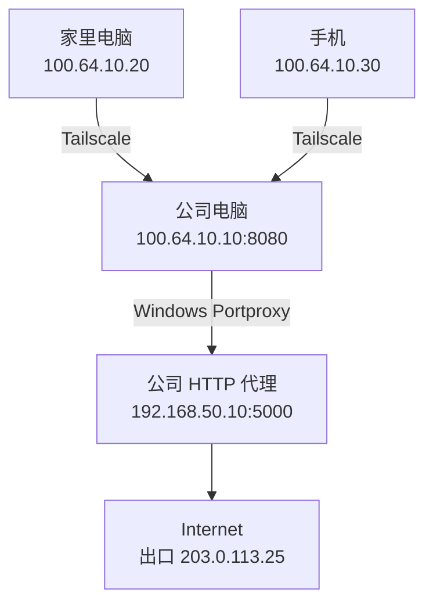

本文记录如何通过 Tailscale 连接公司电脑，再由 Windows Portproxy 将流量转发到公司内网的 HTTP CONNECT 代理。配置完成后，家里的电脑和手机都可以通过这条链路使用公司的公网出口。

> [!NOTE] 核心思路
> 让公司电脑在 Tailscale 地址的 `8080` 端口监听连接，再通过 Windows Portproxy 转发到内网 HTTP 代理 `192.168.50.10:5000`。客户端只需将代理指向 `100.64.10.10:8080`。

> [!WARNING] 使用边界
> 配置前请确认这种远程访问和代理转发方式符合公司的网络、安全与审计政策。本文中的 IP 地址均为特定环境的实际配置，迁移到其他环境时需要按实际情况替换。

## 网络拓扑



### 设备信息

| 设备 | Tailscale IP | 作用 |
| --- | --- | --- |
| 公司电脑 `user` | `100.64.10.10` | Tailscale 节点与 Portproxy 转发端 |
| 家里电脑 | `100.64.10.20` | 客户端 |
| 手机 `xiaomi-17-pro-max` | `100.64.10.30` | 移动客户端 |
| 公司 HTTP Proxy | `192.168.50.10:5000` | 公司内网 HTTP CONNECT 代理 |

最终需要验证的公司公网出口 IP 为 `203.0.113.25`。

> [!NOTE] 示例地址
> 文中的地址均经过虚构处理，仅用于说明配置关系。请替换成你自己的 Tailscale 地址、内网代理地址和实际端口。

## 准备工作

开始配置前，需要确认：

1. 公司电脑已经安装并登录 Tailscale。
2. 家里电脑已经登录同一个 Tailnet。
3. 手机如需使用，也已经安装 Tailscale 并登录同一个 Tailnet。
4. 公司电脑可以访问 `192.168.50.10:5000`。
5. 公司电脑具有管理员权限，可以配置 Windows Portproxy。

## 1. 验证公司 HTTP Proxy

先在公司电脑测试内网代理是否支持 HTTP CONNECT：

```powershell title="公司电脑 · PowerShell"
curl.exe -v -x http://192.168.50.10:5000 https://www.baidu.com/
```

如果输出中出现下面的响应，说明代理地址有效：

```text
HTTP/1.1 200 Connection established
```

> [!IMPORTANT] 先验证上游代理
> 如果公司电脑无法直接通过 `192.168.50.10:5000` 访问目标网站，后续配置 Portproxy 也不会解决问题。

## 2. 配置 Windows Portproxy

以下命令需要在公司电脑的**管理员 PowerShell**中执行。

### 添加转发规则

```powershell title="管理员 PowerShell"
netsh interface portproxy add v4tov4 listenaddress=100.64.10.10 listenport=8080 connectaddress=192.168.50.10 connectport=5000
```

这条规则的含义是：

```text
监听 100.64.10.10:8080
              ↓
转发到 192.168.50.10:5000
```

### 查看转发规则

```powershell
netsh interface portproxy show all
```

正常情况下可以看到类似记录：

```text
100.64.10.10    8080    192.168.50.10    5000
```

## 3. 测试 Tailscale 链路

### 在公司电脑本机测试

```powershell title="公司电脑 · PowerShell"
Test-NetConnection 100.64.10.10 -Port 8080
```

预期结果：

```text
TcpTestSucceeded : True
```

这说明公司电脑的 Tailscale 地址已经能够接受 TCP 连接。

### 从家里电脑测试

```powershell title="家里电脑 · PowerShell"
Test-NetConnection 100.64.10.10 -Port 8080
```

实际验证结果：

```text
ComputerName     : 100.64.10.10
RemoteAddress    : 100.64.10.10
RemotePort       : 8080
InterfaceAlias   : Tailscale
SourceAddress    : 100.64.10.20
TcpTestSucceeded : True
```

此时可以确认“家里电脑 → Tailscale → 公司电脑 `:8080`”这一段已经打通。

## 4. 验证 HTTP 代理和公网出口

在家里电脑执行：

```powershell title="家里电脑 · PowerShell"
curl.exe -v -x http://100.64.10.10:8080 https://api.ipify.org
```

连接日志中应包含：

```text
CONNECT api.ipify.org:443 HTTP/1.1
HTTP/1.1 200 Connection established
```

最终返回：

```text
203.0.113.25
```

这表示完整链路验证成功：

```text
家里电脑
    ↓ Tailscale
公司电脑 100.64.10.10:8080
    ↓ Windows Portproxy
公司代理 192.168.50.10:5000
    ↓
Internet（出口 203.0.113.25）
```

## 5. 在手机上测试

手机连接 Tailscale 后，可以在 Termux 中执行：

```bash title="手机 · Termux"
curl -v -x http://100.64.10.10:8080 https://api.ipify.org
```

测试中返回 `203.0.113.25`，并且连接日志出现：

```text
Established connection to 100.64.10.10
```

这说明手机通过移动网络、Tailscale 和公司电脑转发访问公司代理的链路正常。

## 6. 配置 Windows 系统代理

确认命令行代理测试成功后，可以在家里电脑中设置 Windows 系统代理。

### 通过设置界面配置

打开：

```text
设置
→ 网络和 Internet
→ 代理
→ 手动设置代理
→ 使用代理服务器
```

填写：

| 配置项 | 值 |
| --- | --- |
| 地址 | `100.64.10.10` |
| 端口 | `8080` |

### 通过 PowerShell 配置

启用当前用户的系统代理：

```powershell
reg add "HKCU\Software\Microsoft\Windows\CurrentVersion\Internet Settings" /v ProxyEnable /t REG_DWORD /d 1 /f
reg add "HKCU\Software\Microsoft\Windows\CurrentVersion\Internet Settings" /v ProxyServer /t REG_SZ /d "100.64.10.10:8080" /f
```

查看当前配置：

```powershell
reg query "HKCU\Software\Microsoft\Windows\CurrentVersion\Internet Settings" /v ProxyEnable
reg query "HKCU\Software\Microsoft\Windows\CurrentVersion\Internet Settings" /v ProxyServer
```

预期结果类似：

```text
ProxyEnable    REG_DWORD    0x1
ProxyServer    REG_SZ       100.64.10.10:8080
```

关闭系统代理：

```powershell
reg add "HKCU\Software\Microsoft\Windows\CurrentVersion\Internet Settings" /v ProxyEnable /t REG_DWORD /d 0 /f
```

> [!NOTE] 系统代理的适用范围
> Windows 用户代理并不会被所有软件读取。浏览器通常会使用系统代理，但部分程序拥有独立代理设置；WinHTTP 与当前用户的 Internet Settings 也是不同的配置体系。

## 删除 Portproxy 规则

如果不再需要该转发，可以在公司电脑的管理员 PowerShell 中执行：

```powershell
netsh interface portproxy delete v4tov4 listenaddress=100.64.10.10 listenport=8080
```

然后确认规则已经消失：

```powershell
netsh interface portproxy show all
```

## 故障排查

### Tailscale Ping 不通

在家里电脑执行：

```powershell
tailscale ping 100.64.10.10
```

如果不通，先检查设备是否在线，以及两台设备是否登录同一个 Tailnet。

### Ping 通，但 8080 端口不通

```powershell
Test-NetConnection 100.64.10.10 -Port 8080
```

如果 `PingSucceeded` 为 `True`，但 `TcpTestSucceeded` 为 `False`，说明 Tailscale 本身正常，但 `8080` 端口没有正常监听或转发。

在公司电脑检查：

```powershell
netsh interface portproxy show all
netstat -ano | findstr :8080
```

### 8080 端口通，但代理失败

```powershell
curl.exe -v -x http://100.64.10.10:8080 https://api.ipify.org
```

重点检查日志中是否存在：

```text
CONNECT api.ipify.org:443
HTTP/1.1 200 Connection established
```

如果没有返回 `200 Connection established`，应重点检查公司电脑到 `192.168.50.10:5000` 的连接。

### curl 成功，但应用程序不走代理

这通常表示代理链路本身正常，但应用程序没有读取 Windows 用户代理。检查该程序是否提供独立的代理配置，并用下面的命令再次确认基础链路：

```powershell
curl.exe -x http://100.64.10.10:8080 https://api.ipify.org
```

如果仍返回 `203.0.113.25`，问题就在应用程序的代理设置，而不是 Tailscale 或 Portproxy。

## 常用检查命令

| 使用位置 | 命令 | 预期结果 |
| --- | --- | --- |
| 家里电脑 | `Test-NetConnection 100.64.10.10 -Port 8080` | `TcpTestSucceeded : True` |
| 家里电脑 | `curl.exe -v -x http://100.64.10.10:8080 https://api.ipify.org` | 返回 `203.0.113.25` |
| 公司电脑 | `netsh interface portproxy show all` | 显示 `8080 → 192.168.50.10:5000` |
| 公司电脑 | `netstat -ano \| findstr :8080` | 显示端口正在监听 |
| 手机 Termux | `curl -v -x http://100.64.10.10:8080 https://api.ipify.org` | 返回 `203.0.113.25` |

## 完成检查

- [ ] 公司电脑可以直接访问内网 HTTP 代理
- [ ] 公司电脑的 Tailscale `8080` 端口可以连接
- [ ] 家里电脑能够通过 Tailscale 连接 `8080` 端口
- [ ] `curl` 能够建立 HTTP CONNECT 隧道
- [ ] 返回的公网出口 IP 符合预期
- [ ] 不使用时可以正常关闭系统代理或删除 Portproxy 规则

> [!TIP] 配置完成
> 当客户端测试返回预期的公网出口 IP 时，即可确认 Tailscale、Windows Portproxy、公司 HTTP CONNECT 代理和公网出口组成的完整链路运行正常。
